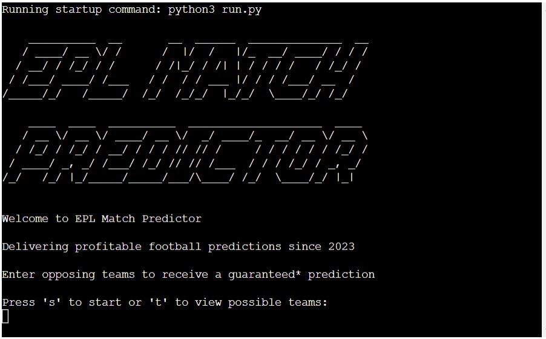
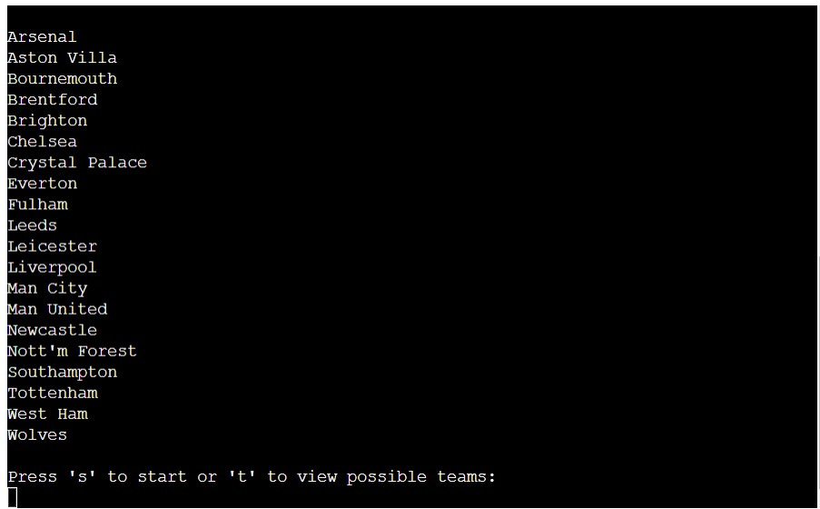

# EPL Match Predictor

 EPL Match Predictor is a terminal program which predicts the outcome of Premier League Matches, using the teams current form to calculate the likelihood of them winning.

[Link To Live Project](https://gm-epl-prediction-dedf30f0a371.herokuapp.com/)

# How it works

The user is prompted to enter two teams from the current season of the English Premier League.

The program then validates the entered teams and calculates a match prediction based on the recent form of both teams.

The user is then given options to enter further team selections.

# Features

- Welcome Message
  - A welcome message is written to the terminal, providing the user with guidelines on the use of the program

 

- Accepts user input
- View Possible teams
  - The user can press 't' to view all available teams, sorted alphabetically

 

- Input validation and error-checking
  - You cannot enter the same team for both home and away
  - There must be exactly two teams entered
  - The teams entered must match exactly to teams in the available teams list
- Google Sheets and Drive API Connectivity
- Data maintained in class instances

# Future Feaures

- Write each prediction to google sheets and provide a summary of the predictions on user request
- Add additional analysis to improve predictions. For example, "Home Advantage"
- Scrape current weeks fixtures from the web and automatically predict all games
- Improve the programs UI by adding colour and additional styling

# Data Model

I created a 'Team' class for storing and analysing a teams information. Upon entering the two teams, they are validated and a 'Team' object is created for each team.

The program then searches the linked google sheet for the relevant results for each team and stores them as class instance attributes.

The program then calculates the teams 'momentum' based on their past 10 results, with a weighting applied to more recent games. If a team has a momentum that is at least 5 more than the opposition, that team is predicted as the winner. If the momentum is within 5 points either way, the game is too close to call and a draw is predicted.

# External Libraries
- pyFiglet
  - This was used to create some graphical text for the name of the program in the welcome message
- gspread
  - Python API for google sheets
- google oauth2
  - Google OAuth 2.0 Library for credentials

# Testing
- I have manually tested the project by doing the following
  - Passed the code through a PEP8 Linter and confirmed there are no problems
  - Entered invalid inputs, Same team twice, not exactly two teams, teams not matching the list
  - Tested in my local terminal and the Code Institute Heroku terminal
  - Manually worked out teams momentum using the google sheet and compared this to the program

# Bugs
- In my validate function, it was not validating one error as my indentation was wrong and one if statement was being ignored if the first if statement triggered

- There were several formatting errors present when the code was run through PEP8

- There are no remining bugs (that we are aware of)

# Validator Testing
- PEP8
  - No errors were returned from PEP8online.com

# Deployment

The site was deployed using Code Institute's mock terminal for Heroku:
- Steps for Deployment:
  - Clone the Code Institute Github Template
  - Create Google Sheet and add relevant historical football data
  - Enable Google Drive and Sheets API's in Google Cloud Services
  - Create a New Heroku App
  - Set the buildbacks to Python and NodeJS in that order
  - Link the Heroku App to the repository
  - Click on Deploy

The live link can be found here - https://gm-epl-prediction-dedf30f0a371.herokuapp.com/

# Credits 

- Code Institute for the Deployment Terminal
- Code Institute for the README template

# THANK YOU!