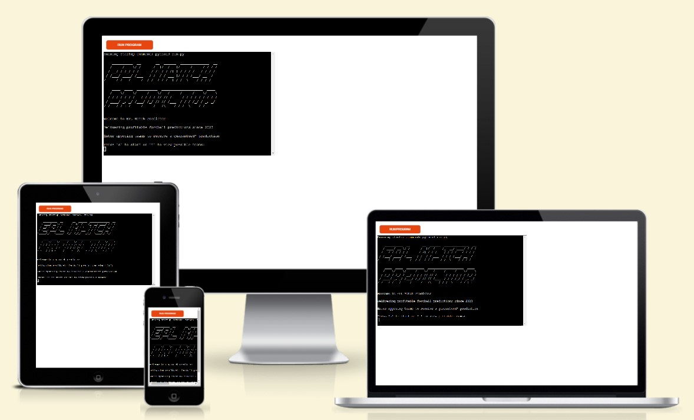

# EPL Match Predictor

 EPL Match Predictor is a terminal program which predicts the outcome of Premier League Matches, using the teams current form to calculate the likelihood of them winning.

[Link To Live Project](https://gm-epl-prediction-dedf30f0a371.herokuapp.com/)

# How to Use
- ## Wireframes
  - I (roughly) hand drew the wireframe for the site using pen and paper. The layout changed slightly as the site developed.
  

- ## Design Choices
  - Color Scheme

 

  - Typography
    - The website uses two different fonts both from google fonts:
      1. Quicksand
      2. Lato

## Feaures 

### Existing Features

- __Navigation Bar__

  - Featured on all three pages, the fully responsive navigation bar includes links to the Logo, Services/home, Technologies, Contact page and also a functional phone  number. It is identical in each page to allow for easy navigation.
  - This section will allow the user to easily navigate from page to page across all devices without having to revert back to the previous page via the ‘back’ button. 

- __The landing page image__

  - The landing page includes a striking photograph of a drone which is one of the key pieces of equipment that this company would use.
  - This section also includes cover text with the company slogan.

- __Services Section__

  - The services section provides a brief overview of the companies offerings, along with an interactive list of the geospatial services offered by the company.
  - The user can click on a service and be redirected to a wikipedia page with further information about that service.

- __The Footer__ 

  - The footer section includes links to the relevant social media sites for Delta Geospatial. The links will open to a new tab to allow easy navigation for the user. 
  - On hover, the link icons highlight to the relative colour of the social media site.

- __Technologies__

  - The technologies page will provide the user with a capability statement and a list of technologies used by the company. These are represented with images and a brief description of the technolgy.
  - This will highlight to the user that only state of the art equipment and software is being utilised.

- __The Contact Page__

  - This page will allow the user to send a message to the company via a form and also view phone, email and street address.
  - There is a google map on the page which will be of instant value to the user.

### Features Left to Implement

- Individual pages for each service will be added in future as opposed to the links to wikipedia
- A Projects page will be added to highlight some recent projects which the company has successfully undertaken.

## Testing 

- Testing was carried out on all three pages of the website. The testing was carried out on the following devices:
  - Desktop
  - Tablet
  - Mobile
- Tested using the lightroom dev tool in Google Chrome.

### Validator Testing 

- HTML
  - No errors were returned when passing through the official [W3C validator](https://validator.w3.org/nu/?doc=https%3A%2F%2Fgarymast.github.io%2Fgeospatial-co%2Findex.html)

- CSS
  - No errors were found when passing through the official [(Jigsaw) validator](https://jigsaw.w3.org/css-validator/validator?uri=https%3A%2F%2Fgarymast.github.io%2Fgeospatial-co%2Findex.html&profile=css3svg&usermedium=all&warning=1&vextwarning=&lang=en)

### Bugs and Issues

Debugging and troubleshooting was done continuously throughout the development process. All known bugs have now been removed.

## Deployment

- The site was deployed to GitHub pages. The steps to deploy are as follows: 
  - In the GitHub repository, navigate to the Settings tab 
  - From the source section drop-down menu, select the Master Branch
  - Once the master branch has been selected, the page will be automatically refreshed with a detailed ribbon display to indicate the successful deployment. 

The live link can be found here - https://garymast.github.io/geospatial-co/index.html

# Credits 

- Code Institute for the Deployment Terminal

# THANK YOU!